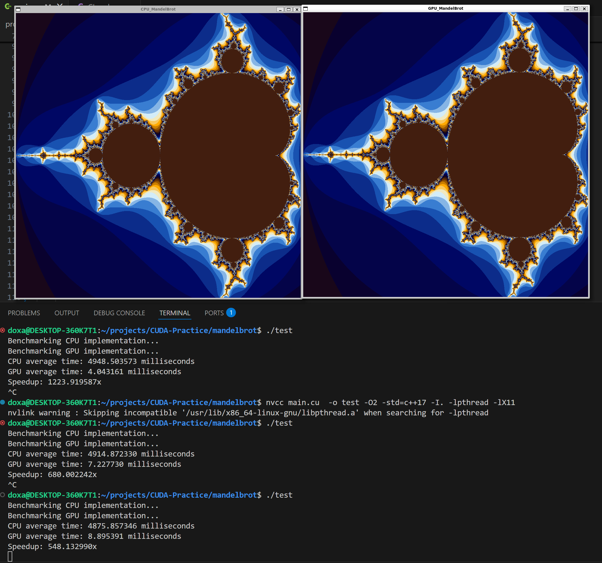

# Accelerating Mandelbrot Drawing with CUDA

Using the CImg library and simple unoptimized Escape Time Algorithm for illustrating the Mandelbrot Set and demonstrating how CUDA allows for massive speedups.

